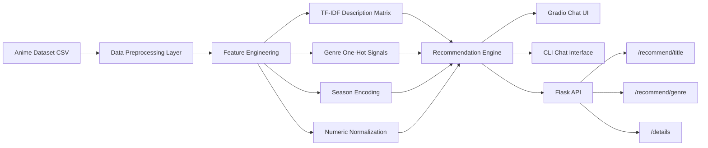

# AniScope AI

[](https://github.com/prashantsingh5/Anime_Recommendation_AI/actions/workflows/ci.yml)
[](https://www.python.org/)
[](LICENSE)

A production-style recommendation system that turns anime metadata into high-quality personalized suggestions through a modular ML pipeline. The project ships with multiple interfaces (Gradio flagship chat UI, CLI, and REST API), automated tests, and CI checks to reflect real software engineering standards.

## Flagship Highlights

- Modular recommendation architecture with reusable core engine
- Multi-signal ranking with configurable feature weights
- Typo-tolerant fuzzy matching for better UX
- Robust preprocessing pipeline with schema validation and HTML cleaning
- Professional project setup: tests, linting, CI workflow, docs, contribution guide, MIT license
- Resume-ready engineering artifacts in `docs/RESUME_BULLETS.md`

## System Design

Pipeline in one line:
`Raw CSV -> preprocessing -> feature extraction -> weighted similarity -> top-N ranking -> CLI/API response`

Scoring uses four blended signals:

- Genre overlap similarity
- Description similarity using TF-IDF + cosine similarity
- Seasonal similarity from one-hot encoded season features
- Numeric profile similarity across year, score, popularity, episodes

Weights are configurable in `src/config.py` using `SIMILARITY_WEIGHTS`.

## Architecture Diagram



## Repository Structure

```text
aniscope-ai/
  .github/workflows/
    ci.yml
  data/
    anime_dataset_new.csv
  docs/
    ARCHITECTURE.md
    RESUME_BULLETS.md
    SHOWCASE_CHECKLIST.md
  src/
    api.py
    config.py
    constants.py
    data_preprocessing.py
    recommendation_engine.py
    user_interface.py
    main.py
  tests/
    test_preprocessing.py
    test_recommendation_engine.py
  CONTRIBUTING.md
  LICENSE
  pyproject.toml
  requirements.txt
  run.py
```

## Quickstart (Windows, venv)

```powershell
python -m venv .venv
.\.venv\Scripts\activate
python -m pip install --upgrade pip
pip install -r requirements.txt
```

## Run

CLI chatbot mode:

```powershell
python src/main.py --mode chat
```

API mode:

```powershell
python src/main.py --mode api --host 127.0.0.1 --port 5000
```

Alternative root entrypoint:

```powershell
python run.py --mode api
```

Gradio flagship chat UI:

```powershell
python gradio_app.py
```

## API Reference

- `GET /health`
- `POST /recommend/title`
  - body: `{ "title": "cowboy bebop", "top_n": 10 }`
- `POST /recommend/genre`
  - body: `{ "query": "action sci-fi", "top_n": 10 }`
- `GET /details?title=cowboy%20bebop`

Example request:

```bash
curl -X POST http://127.0.0.1:5000/recommend/title \
  -H "Content-Type: application/json" \
  -d '{"title":"cowboy bebop","top_n":5}'
```

## Quality Gates

```powershell
ruff check .
pytest
```

CI runs lint + tests on push and pull request via `.github/workflows/ci.yml`.

## Offline Evaluation Metrics

Run offline evaluation to report ranking quality metrics:

```powershell
python evaluate_offline.py --k 10 --sample-size 100 --min-relevant 5
```

Latest run results:

- `evaluated_queries`: `100`
- `precision@10`: `0.9990`
- `recall@10`: `0.0024`
- `hit-rate@10`: `1.0000`

Metrics included:

- `precision@k`: fraction of top-k recommendations that are relevant
- `recall@k`: fraction of relevant items recovered in top-k
- `hit-rate@k`: percentage of queries with at least one relevant item in top-k

## Resume/Portfolio Assets

- Architecture explainer: `docs/ARCHITECTURE.md`
- Resume bullets and ATS keywords: `docs/RESUME_BULLETS.md`
- Publishing checklist: `docs/SHOWCASE_CHECKLIST.md`

## Showcase UI

Use the Gradio app for a professional conversational showcase with guided chat state.

- Features included:
  - guided recommendation conversation flow
  - slash commands (`/title`, `/genre`, `/details`)
  - quick action panels for fast demo prompts
  - polished branded styling for portfolio demos
- File: `gradio_app.py`

## License

MIT
