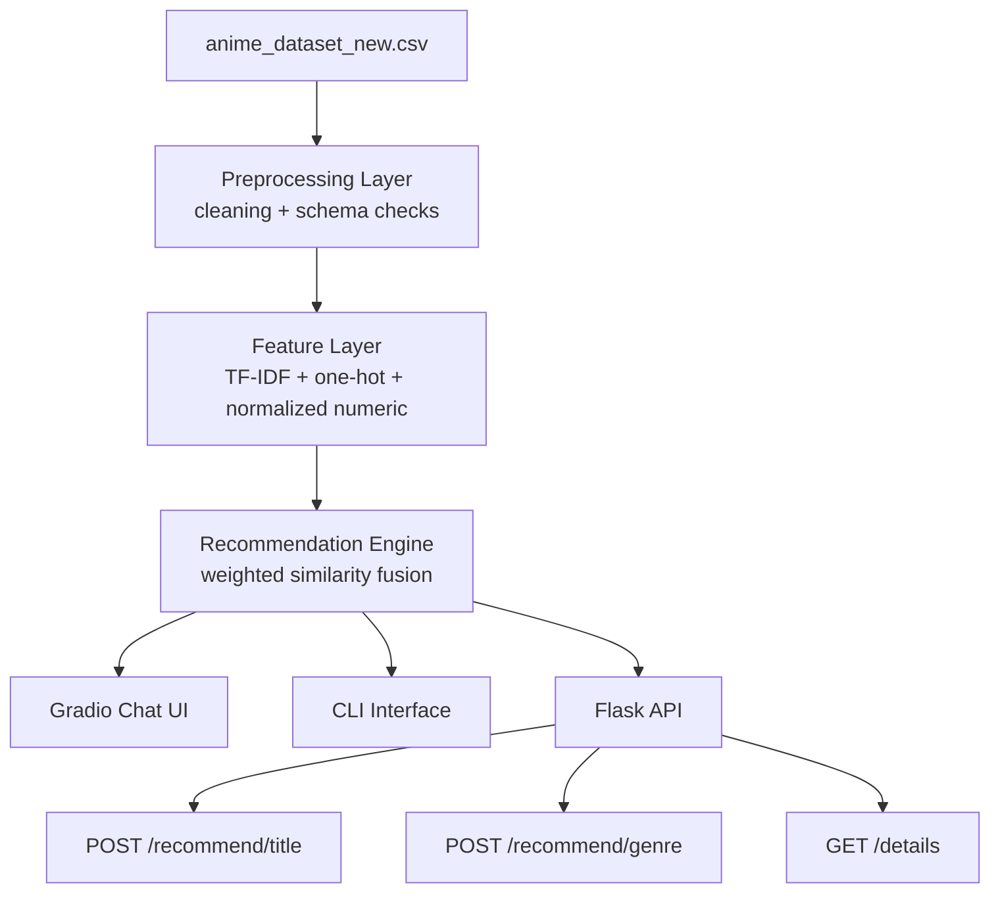

# Architecture

## Mermaid Diagram

## Overview

The system is built around a shared recommendation core consumed by two interfaces:

- CLI conversation interface for interactive usage
- Flask API for app and service integration

## Layers

1. Data layer
- `src/data_preprocessing.py` loads and normalizes dataset records.
- HTML cleanup and schema checks happen before feature generation.

2. Recommendation layer
- `src/recommendation_engine.py` computes multi-signal similarity:
  - genre overlap
  - description cosine similarity (TF-IDF)
  - season one-hot similarity
  - numeric profile similarity
- Weights are centralized in `src/config.py`.

3. Interface layer
- `src/user_interface.py` handles CLI dialog flow.
- `src/api.py` exposes `/health`, `/recommend/title`, `/recommend/genre`, and `/details`.

4. Entry layer
- `src/main.py` chooses `chat` or `api` mode.

## Design Choices

- A single recommendation core avoids drift between CLI and API behavior.
- Configuration centralization improves maintainability and tunability.
- Tests validate both preprocessing and recommendation behavior.
